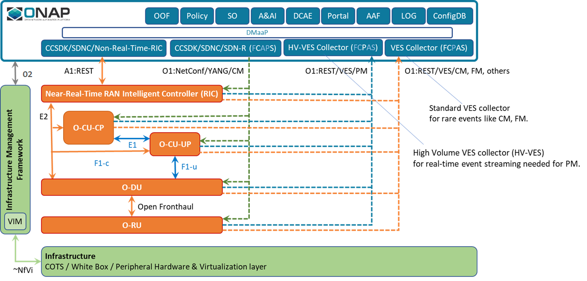

.. SPDX-License-Identifier: CC-BY-4.0
.. Copyright 2020 Nordix Foundation
.. _architecture:

Architecture
============

************
Introduction
************

The CCSDK ORAN components provides handling of the O-RAN A1 interface.

*********************************************
Global NBI architecture for Frankfurt release
*********************************************

Following illustration provides a global view about Non-Real-Time-RIC architecture,
integration with other ONAP components and API resource/operation provided.

***************
Developer Guide
***************

Technical information about the ORAN components (dependencies, configuration, running & testing) could be found in :ref:`developer_guide`.

