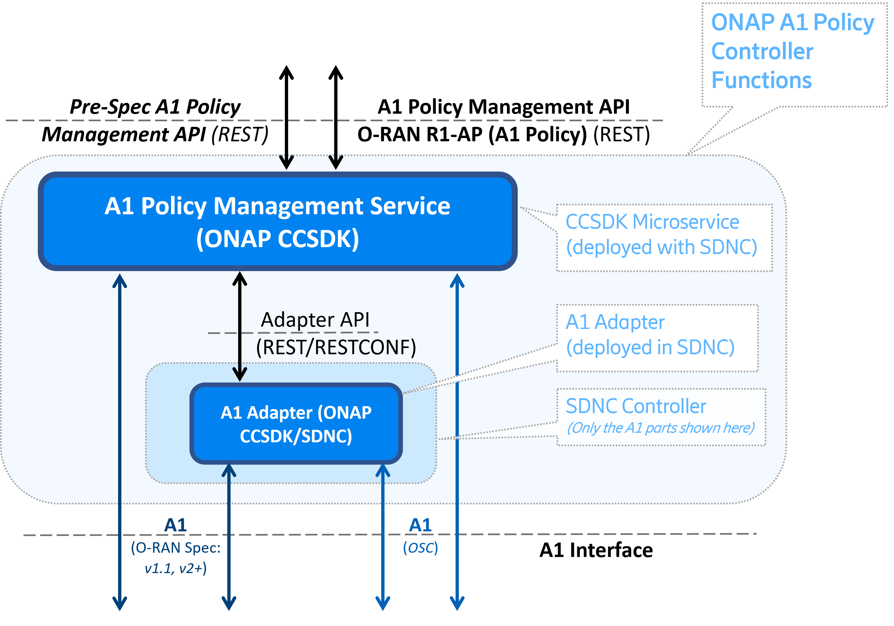

.. This work is licensed under a Creative Commons Attribution 4.0 International License.
.. http://creativecommons.org/licenses/by/4.0
.. Copyright 2022-2024 Nordix Foundation
.. Copyright 2024-202% OpenInfra Foundation Europe

.. _architecture:

Architecture
============

************
Introduction
************

The CCSDK ORAN components add support for handling "A1 Policies" as defined for the O-RAN A1-P interface.

The O-RAN A1-P interface is defined and specified by the `O-RAN Alliance <https://www.o-ran.org>`_

*******************
Architecture Review
*******************

This picture provides a overview of ONAP's A1 Controller architecture,
integration with other components and API resource/operation provided.

The A1 Policy Management Service provides an API for accessing of A1 Policies. The A1-PMS
configures A1-Policies in RAN nodes (near-RT RICs). It also keeps a synchronized copy of these in case the A1-PMS needs to restart. 
Periodically A1-PMS will check that the configured A1 Policies and A1 Policy Types are consistent with those in the managed near-RT RICs (and take action if not).
 
Communications to near-RT RIC can be tunneled through a CCSDK/SDNC controller, using our SDNC A1-Adapter plugin.

The A1-PMS now also supports fine-grained access control checks, whereby access requests can be forwarded to an external authorization provider.

More details can be found in :ref:`developer_guide`.

***************
Developer Guide
***************

Technical information about the O-RAN components (dependencies, configuration, running & testing) can be found in :ref:`developer_guide`.

