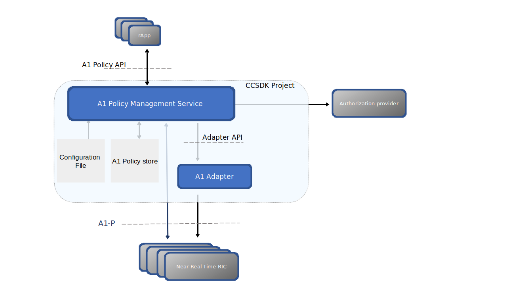

.. SPDX-License-Identifier: CC-BY-4.0
.. Copyright 2022 Nordix Foundation
.. _architecture:

Architecture
============

************
Introduction
************

The CCSDK ORAN components add support for handling "A1 Policies" as defined for the O-RAN A1-P interface.

The O-RAN A1-P interface is defined by the `O-RAN Alliance <https://www.o-ran.org>`_

*******************
Architecture Review
*******************

This picture provides a overview of ONAP's A1 Controller architecture,
integration with other components and API resource/operation provided.

The A1 Policy Management Service provides an API for accessing of A1 Policies. The PMS
configures these in the traffical elements (NearRT-RICS). It also keeps a backup of these in case of restart of PMS.
On regular basis, it will check that the configured A1 Policices are consistent with the actual ones in the NearRT-RICS (and take action if not).
 
The access to the NearRT-RIC may be tunneled through an A1 adapter in the CCSDK/SDNC controller.

The A1 PMS provides support for fine granied access control, which is implemented by delegating the granting of access of A1 Policies to an external
authorization provider.

More details can be found in :ref:`developer_guide`.

***************
Developer Guide
***************

Technical information about the O-RAN components (dependencies, configuration, running & testing) can be found in :ref:`developer_guide`.

