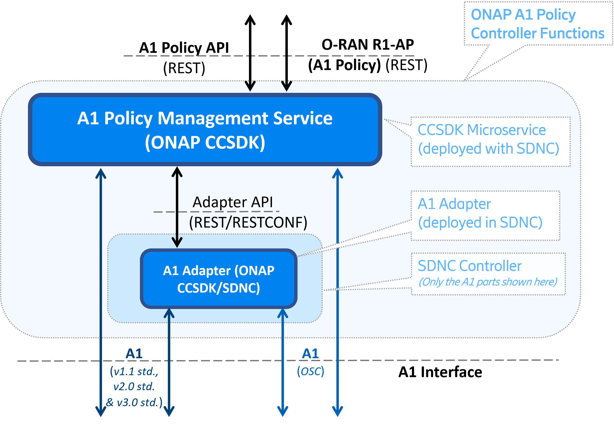

.. This work is licensed under a Creative Commons Attribution 4.0 International License.
.. http://creativecommons.org/licenses/by/4.0
.. Copyright 2023 Nordix Foundation. All rights reserved.
.. Copyright 2024 OpenInfra Foundation Europe. All rights reserved.

.. _developer_guide:

Developer Guide
===============

This document provides a quickstart for developers of the CCSDK functions for O-RAN A1 Policies.

Source tree
+++++++++++

This provides ONAP CCSDK with "A1 Policy Management Service" and "A1 Adapter" functions.
Each resource is implemented independently in a sub-directory corresponding to its name.

A1 Policy Management Service
++++++++++++++++++++++++++++

The ONAP CCSDK A1 Policy Management Service (A1-PMS) is a Java 17 web application built using the Spring Framework.
Using Spring Boot dependencies, it runs as a standalone application.

A1 Policy Management Service provides a REST API for managing A1 Policies. It provides support for:

 * Consistency monitoring of the SMO view of policies and the actual situation in the RICs
 * Consistency monitoring of near-RT RIC capabilities (e.g. supported A1 Policy Types)
 * Supervision of clients (e.g. 'rAPPs') that use the northbound interface, to help garbage-collect & remove un-owned policies (e.g. in case of failures)
 * A1 Policy configuration. This includes:

   * One REST API towards all near-RT RICs in the network
   * Query functions to discover A1 Policy Types supported by each near-RT RIC
   * Query functions to find all A1 Policy instances in each near-RT RIC, all A1 Policies owned by a service (e.g. rAPP or client), all A1 Policies of certain A1 Policy Type etc.
   * Create/Modify/Delete operations for A1 Policy Instances in each near-RT RIC
   * Query functions to check the status of each near-RT RIC, and their A1 Policy Instances. 

The A1 Policy Management Service can be accessed over the REST API. See :ref:`pms_api` for more information about the API.

The configured A1 Policies are stored persistently, and can survive service restart. This state information can be stored in a persistent volume or in an S3 Object Store bucket. 

Dependencies
------------

This project uses various frameworks which are managed with Maven
dependency management tool (see *pom.xml* file at root level) :

- Swagger annotations
- `Spring Framework <https://github.com/spring-projects/spring-boot>`_
- `SpringDoc and OpenAPI <https://springdoc.org/>`_ Automated JSON API documentation for APIs built with Spring
- `Lombok <https://github.com/projectlombok/lombok>`_ to generate code, such as getters and setters
- `Awaitility <https://github.com/awaitility/awaitility>`_ to test asynchronous functionality

To get a complete list of all dependencies, use command "mvn dependency:tree".

Configuration
-------------

There are two configuration files for A1 Policy Management Service, *config/application_configuration.json* and *config/application.yaml*
The first (*config/application_configuration.json*) contains application-specific configuration needed by the application, such as which near-RT RICs, or controller to use.
The second (*config/application.yaml*) contains logging and security configurations.

For more information about these configuration files can be found as comments in the sample files provided with the source code, or on the `ONAP wiki <https://lf-onap.atlassian.net/wiki/spaces/DW/pages/16544264/O-RAN+A1+Policies+in+ONAP+New+Delhi>`_

Static configuration - Settings that cannot be changed at runtime (*application.yaml*)
--------------------------------------------------------------------------------------

The file *./config/application.yaml* is read by the application at startup. It provides the following configurable features:

 * *server*; configuration for the WEB server

   * used port for HTTP/HTTPS, this is however not the port number visible outside the container
   * SSL parameters for setting up using of key store and trust store databases.
 * *webclient*; configuration parameters for a web client used by the component

   * SSL parameters for setting up using of key store and trust store databases.
   * Usage of HTTP(S) Proxy; if configured, the proxy will be used for southbound access to the NearRT-RICs

 * *logging*; setting for which information is logged.
 * *auth-token*; optional authorization token to use for REST call.
 * *filepath*; the local path to a file used for dynamic configuration (if used). See next chapter.
 * *persistent storage* of runtime information. Configuration of A1 Policy instances is stored persistently. The media for this can be either filesystem (a persistent volume) or Amazon S3 - Cloud Object Storage.

For details about the parameters in this file, see documentation in the file.

Dynamic configuration - Settings that can be changed at runtime (*application_configuration.json* or REST or ConfigMap)
-----------------------------------------------------------------------------------------------------------------------
The component has configuration that can be updated in runtime. This configuration can either be loaded from a file (accessible from the container), or using the Configuration REST API. The configuration is re-read and refreshed at regular intervals if the file is changed (e.g. using  K8s ConfigMap capabilities).

The configuration includes:

  * Optional *Controller* configuration, e.g. an SDNC instance (with A1-Adapter)

    * (If no 'Contoller' is configured, the A1 Policy Management Service will connect direct to near-RT RICs, bypassing the SDNC controller)
  * One entry for each near-RT-RIC (*ric*), which includes:

    * The base URL of the near-RT-RIC
    * A optional list of O1 identifiers that near-RT-RIC is controlling. An application can query this service which near-RT-RIC should be addressed for which component (e.g. cells, sectors, locations, etc.).
    * An optional reference to the controller to use, or excluded if the near-RT-RIC should be accessed directly from the A1 Policy Management Service.

For details about the syntax of the file, there is an example in source code repository */config/application_configuration.json*. This file is also included in the docker container */opt/app/policy-agent/data/application_configuration.json_example*.

Configuring certificates
------------------------

The A1 Policy Management Service uses the default security keystore and truststore that are included in the built container. The paths and
passwords for these stores are located in the static configuration file described above (*application.yaml*), with an example is provided in the source code repository *a1-policy-management/config/application.yaml*

A default cert and truststore is also included in the A1 Policy Management Service, but should only be used for *mocking* and *testing* purposes.
(*ApplicationTest.java*).

The default keystore, truststore, and application.yaml files can be overridden by mounting new files using the the docker 'volumes'
command for 'docker-compose' or 'docker run' command. Assuming that the *keystore*, *truststore*, and *application.yaml* files are located in the same directory as 'docker-compose',
the volumes field should have these entries: ::

   `volumes:`
      `- ./new_keystore.jks:/opt/app/policy-agent/etc/cert/keystore.jks:ro`
      `- ./new_truststore.jks:/opt/app/policy-agent/etc/cert/truststore.jks:ro`
      `- ./new_application.yaml:/opt/app/policy-agent/config/application.yaml:ro`

The target paths in the container should not be modified.

Example 'docker run' command for mounting new files (assuming they are located in the current directory): ::

   docker run -p 8081:8081 -p 8433:8433 --name=policy-agent-container --network=nonrtric-docker-net --volume "$PWD/new_keystore.jks:/opt/app/policy-agent/etc/cert/keystore.jks" --volume "$PWD/new_truststore.jks:/opt/app/policy-agent/etc/cert/truststore.jks" --volume "$PWD/new_application.yaml:/opt/app/policy-agent/config/application.yaml" onap/ccsdk-oran-a1policymanagementservice:1.5.0

A1 Adapter (Internal)
+++++++++++++++++++++

The O-RAN A1 Adapter provides an **internal** RESTCONF API that is used only by the A1 Policy Management System when accessing the A1 Interface via SDNC. This API is useful for test and verification but should not used otherwise.

See :ref:`a1_adapter_api` for details of this internal API.

Configuration of HTTP Proxy
---------------------------

In order to configure a HTTP Proxy for the A1-Adapter to use for southbound connections:

  * Modify file: *odlsli/src/main/properties/a1-adapter-api-dg.properties*. This file is found in CCSDK/distribution for SDNC.
  * In a running container this file is found at */opt/onap/ccsdk/data/properties/a1-adapter-api-dg.properties*
  * Variable *a1Mediator.proxy.url* must contain the full Proxy URL

After this configuration has been changed the A1 adapter needs to be either rebuilt, or restarted if the configuration is changed inside a container, or re-read by the container if externally accessible (e.g. K8s ConfigMap).

