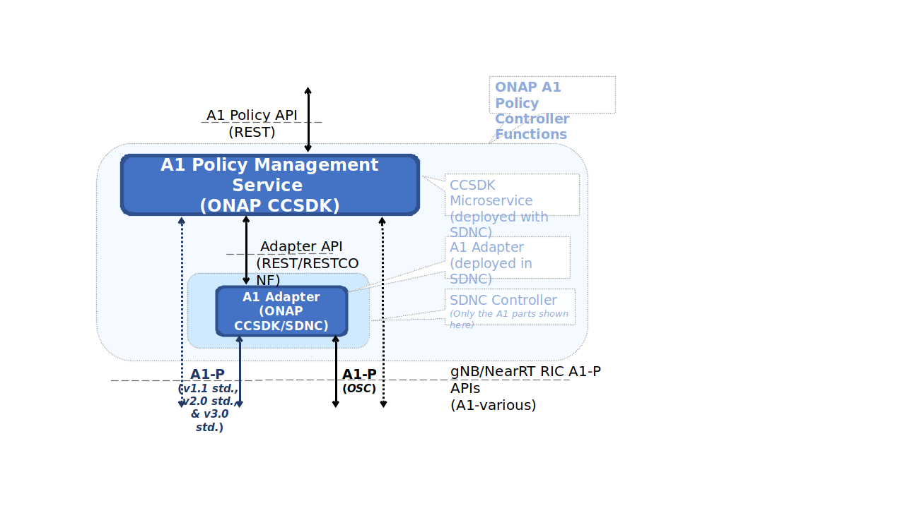

.. This work is licensed under a Creative Commons Attribution 4.0
   International License.
.. http://creativecommons.org/licenses/by/4.0
.. Copyright 2020 Nordix Foundation

.. _offered_apis:

Offered APIs
============

Introduction
------------

The north bound REST API of the A1 Policy Management Service provides convenient methods to handle policies.

Overall architecture for O-RAN A1 Policy functions
--------------------------------------------------

This picture provides a overview of ONAP's A1 Controller architecture,
integration with other ONAP components and API resource/operation provided.

API Version
-----------

APIs are described with a  state version with "v" following the API Name,
e.g.:  ``v2/policy``.
The schema associated with a REST API must have its version number aligned
with that of the REST API.

API Table
---------

.. csv-table::
   :header: "API name", "|swagger-icon|", "|yaml-icon|"
   :widths: 10,5, 5

   "A1 Policy Management Service API (NBI)", ":download:`link <./swagger/pms-api.json>`", ":download:`link <./swagger/pms-api.yaml>`"
   "A1 ADAPTER API (Internal)", ":download:`link <./swagger/a1-adapter-api.json>`", ":download:`link <./swagger/a1-adapter-api.yaml>`"

.. _pms_api:

A1 Policy Management Service API
................................

The A1 Policy Management Service API is described in more detail in `A1 Policy Management Service API (html) <./pms-api.html>`_

.. _a1_adapter_api:

A1 ADAPTER API
..............

The O-RAN A1 Adapter provides an **internal** RESTCONF API that is used by the A1 Policy Management System when accessing the A1 Interface. This API is useful for test and verification but should not be used otherwise.

The A1 Adapter API is described in more detail in `A1 ADAPTER API (html) <./a1-adapter-api.html>`_
